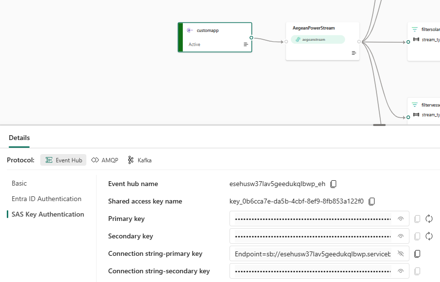
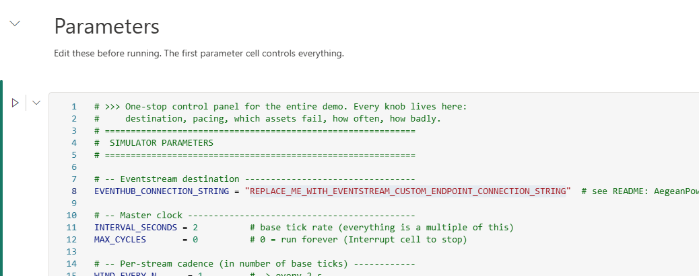

# Fabric Energy RTI + Ontology Demo

End-to-end Microsoft Fabric demo for the energy sector: **Real-Time Intelligence** + **Ontology-driven Data Agents**.

A fictional Greek energy company — **Aegean Power S.A.** — operates wind farms, solar parks, gas plants, an island grid, and a logistics fleet. This demo shows how Microsoft Fabric ties operational telemetry, business data, and AI agents into a single closed-loop story.

---

## What's in the demo

```
                         ┌──────────────────────┐
                         │  AegeanPower_Simulator│  (notebook → Event Hub)
                         └──────────┬───────────┘
                                    │
                                    ▼
                      ┌─────────────────────────┐
                      │  AegeanPowerStream     │  Eventstream (5 filters)
                      └─────────────┬───────────┘
                                    │
              ┌────────┬────────┬───┴────┬────────┬─────────┐
              ▼        ▼        ▼        ▼        ▼         │
            Wind    Solar    Grid    Vessel   Emissions     │
              │        │        │        │        │         │
              ▼        ▼        ▼        ▼        ▼         │
           ┌────────────────────────────────────────┐       │
           │           AegeanPowerEH (KQL DB)       │◀──────┘
           └────────────┬───────────────────────────┘
                        │
        ┌───────────────┼────────────────────┐
        ▼               ▼                    ▼
  Real-Time      WT-Failures-Activator   AnomalyDetector
  Dashboard         │                    (ML model)
                    ▼
            Dispatch_Maintenance_Crew (notebook)
                    │
                    ▼
            Vessel routing change in simulator
```

Plus the **Ontology + Data Agent** side:

```
   ┌───────────────────┐      ┌──────────────────────┐
   │  AegeanPowerLH    │◀────│  AegeanPowerOntology │
   │  (Delta tables)   │      └──────────────────────┘
   └────────┬──────────┘                │
            │                           ▼
            │              ┌──────────────────────┐
            └─────────────▶│  AegeanPowerDataAgent │   (NL → answers)
                           └──────────────────────┘
```

---

## Repo layout

| Folder | What it is |
|---|---|
| `*.Notebook/`, `*.Lakehouse/`, `*.Eventhouse/`, … | Fabric items in Git format. Sync to your workspace via **Update all**. |
| `data/` | 8 seed CSVs for the Lakehouse (power plants, wind turbines, solar inverters, vessels, etc.). |
| `docs/` | Demo script, prompts, troubleshooting. |

---

## Quickstart

### 0 · Prerequisites

**Personal:**
- Fabric capacity (F2+ or P SKU). Trial may not support Git integration in all regions.
- **Contributor** or higher on the workspace you create.
- A GitHub account.

**Tenant admin settings** — make sure your Fabric admin has enabled the tenant settings required for:

- **Git integration** — to sync the workspace with this GitHub repo
- **Fabric Data Agent** — see [Configure Fabric data agent tenant settings](https://learn.microsoft.com/en-us/fabric/data-science/data-agent-tenant-settings)
- **Ontology + Graph** — see [Required tenant settings for ontology](https://learn.microsoft.com/en-us/fabric/iq/ontology/overview-tenant-settings)
- **Anomaly Detector (preview)** — see [Anomaly detection in Real-Time Intelligence](https://learn.microsoft.com/en-us/fabric/real-time-intelligence/anomaly-detection?tabs=eventhouse).

Settings can take up to one hour to take effect after the admin toggles them.

---

### 1 · Fork this repo

Click **Fork** (top-right on GitHub) → owner = your account → **Create fork**.

You now own `https://github.com/<you>/fabric-energy-rti-ontology` with the `main` branch.

### 2 · Create an empty Fabric workspace

Fabric portal → **Workspaces** → **+ New** → assign your capacity. Name it whatever you like (e.g. `Energy-Demo-<you>`).

### 3 · Connect your workspace to your fork

In the workspace: **Workspace settings → Git integration → Connect**:

- Provider: **GitHub**
- Authorize (PAT with `Contents: read/write` on your fork)
- Repository URL: `https://github.com/<you>/fabric-energy-rti-ontology`
- Branch: **`main`**
- Git folder: *(blank)*
- **Connect and sync** → **Update all**

Fabric pulls every item into your workspace.

### 4 · Bind a default Lakehouse to each notebook

Notebooks in the repo intentionally have **no default Lakehouse** so they sync cleanly across any workspace. For each of these four notebooks, open them and bind `AegeanPowerLH` as the default Lakehouse:

- **`AegeanPower_Simulator`**
- **`Demo_Trigger_Console`**
- **`Dispatch_Maintenance_Crew`**
- **`Load_CSVs_to_Delta`**

How to bind: open the notebook → left **Lakehouses** sidebar → **+ Add lakehouse** → **Existing lakehouse** → pick `AegeanPowerLH` → in the sidebar, right-click the lakehouse → **Set as default lakehouse**.

### 5 · Upload seed data to the Lakehouse

1. Open **`AegeanPowerLH`** in the workspace.
2. **Files** → **Upload** → **Upload folder** → select your local clone's `data/` folder.
3. Confirm `Files/data/*.csv` shows 8 files.

### 6 · Load CSVs to Delta tables

Open **`Load_CSVs_to_Delta`** notebook → **Run all**.

You should now see 8 Delta tables under `Tables/`:
`power_plants`, `wind_turbines`, `solar_inverters`, `maintenance_orders`, `vessels`, `substations`, `emissions_ledger`, `island_grids`.

### 7 · Wire the Eventstream

Open **`AegeanPowerStream`** → **Edit**.

1. Click each of the 5 destinations (`destwindturbinetelemetry`, `destsolarinvertertelemetry`, `destgridtelemetry`, `destvesselpositions`, `destemissionsstream`) and **verify** the right-side pane shows:
   - **Workspace** = your workspace
   - **Eventhouse** = `AegeanPowerEH`
   - **KQL Destination table** = the matching name
   - **Input data format** = `Json`

   Fabric usually auto-remaps these on first sync, so they may already be correct. If anything looks wrong, fix it and save.

2. Click **Publish** in the top toolbar.

3. Switch to **Live view** (top-right of the canvas). Click the **customapp** source node. In the right-side **Details** pane (Protocol: **Event Hub** → **SAS Key Authentication**), copy the value of **Connection string-primary key**.

   It looks like:
   ```
   Endpoint=sb://<namespace>.servicebus.windows.net/;SharedAccessKeyName=key_<guid>;SharedAccessKey=<base64>;EntityPath=<eventhub_name>
   ```

   

### 8 · Paste the connection string into the simulator

Open the **`AegeanPower_Simulator`** notebook. Scroll to the **Parameters** section (the first code cell under the *"Parameters — Edit these before running"* heading) and locate the line:

```python
EVENTHUB_CONNECTION_STRING = "REPLACE_ME_WITH_EVENTSTREAM_CUSTOM_ENDPOINT_CONNECTION_STRING"
```

Replace the placeholder with the connection string you copied in step 7. Save the notebook.



### 9 · Run the simulator

**`AegeanPower_Simulator`** → **Run all**. After ~30 s, verify data is flowing in a KQL query window:

```kql
WindTurbineTelemetry | where timestamp > ago(2m) | summarize n=count()
```

Expect `n > 0`.

### 10 · Re-bind the Activator

Open **`WT-Failures-Activator`** → **WT-Failures-Rule**:

- **Event stream**: confirm it points to *your* `AegeanPowerStream → derivedwindturbinetelemetry`.
- **Action → Run Notebook**: re-pick *your* `Dispatch_Maintenance_Crew` notebook.
- **Parameters**: ensure `turbine_id` maps to the event's `turbine_id`.
- **Save** → **Start**.

### 11 · Re-bind Ontology data bindings

The Ontology's entity data bindings still point to the original Eventhouse cluster URL. Open **`AegeanPowerOntology`** → for each entity (PowerPlant, WindTurbine, SolarInverter, IslandGrid, Vessel, MaintenanceOrder, Substation, EmissionsRecord):

- Click the entity → **Data bindings** tab
- Re-pick the source: your `AegeanPowerEH` (KQL DB) or `AegeanPowerLH` (Lakehouse) → matching table
- **Save**

### 12 · Add data sources to the Data Agent

Open **`AegeanPowerDataAgent`** → **+ Data source**:
- Type: **Ontology** → **AegeanPowerOntology** (recommended — gives the agent semantic context)
- *Or* Type: **Lakehouse** → **AegeanPowerLH** → tick all 8 tables
- *Optional:* KQL DB source → **AegeanPowerEH** → tick all 5 tables

Click **Publish**.

### 13 · Re-bind the dashboard data source

Open **`AegeanPower_Live_Operations`**. Tiles will be empty because the dashboard still references the original Eventhouse cluster URL.

- Top toolbar → **Manage** → **Data sources**
- Edit the existing entry → re-pick your `AegeanPowerEH`
- **Save** → refresh the page → tiles populate.

### 14 · You're ready

Walk through [docs/DEMO_SCRIPT.md](docs/DEMO_SCRIPT.md). Try a prompt from [docs/PROMPTS.md](docs/PROMPTS.md). Trigger a failure from `Demo_Trigger_Console`.

---

## Demo highlights

- **Real-time pipeline**: 51 entities emit ~17 events/s through Eventstream → Eventhouse → Dashboard.
- **Autonomous remediation**: Activator detects a turbine fault → triggers a notebook → a vessel re-routes on the live map.
- **Ontology-aware AI**: Data Agent answers business questions (Cyclades wind output? Open maintenance + vessel intersection?) grounded in a clean semantic model.

---

## Troubleshooting

See [docs/TROUBLESHOOTING.md](docs/TROUBLESHOOTING.md) for the most common gotchas (Activator state, eventstream schema, empty `fault_type`, etc.).

---

## License

MIT — see [LICENSE](LICENSE).
