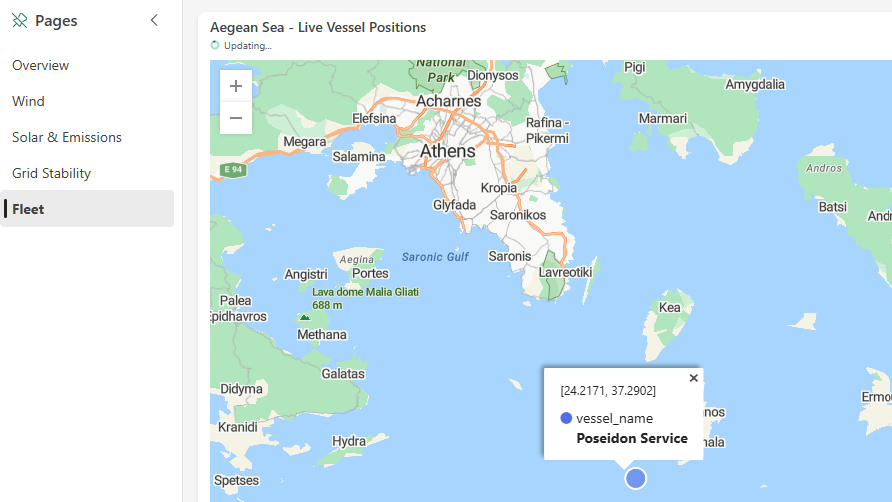
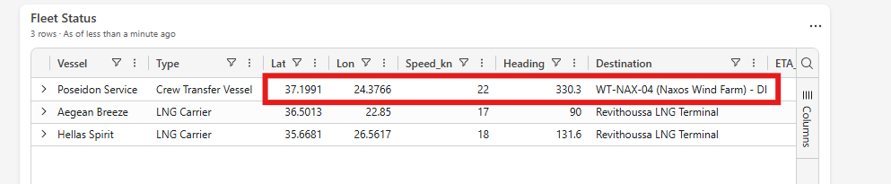
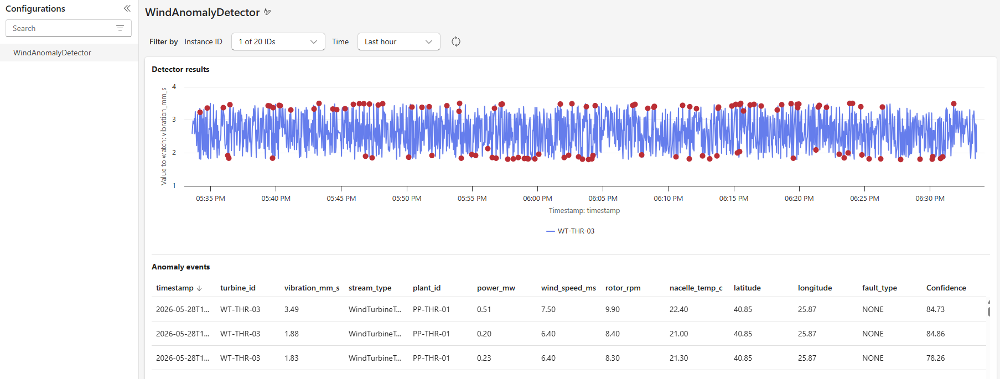
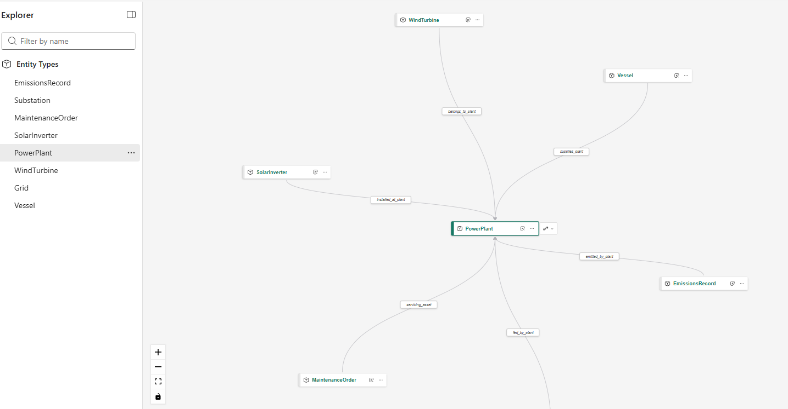
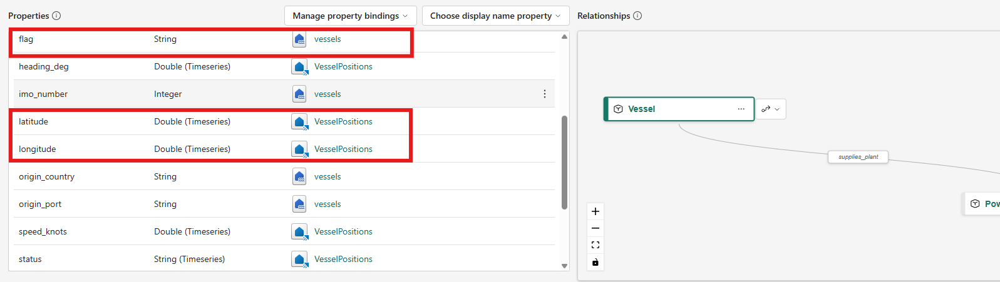
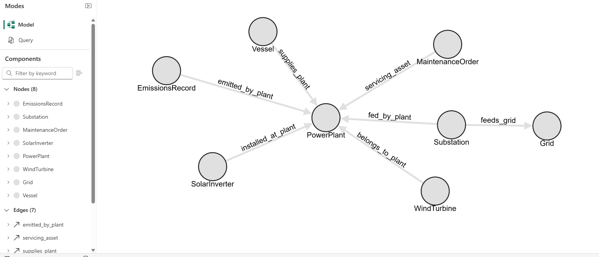
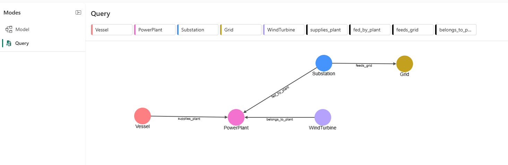
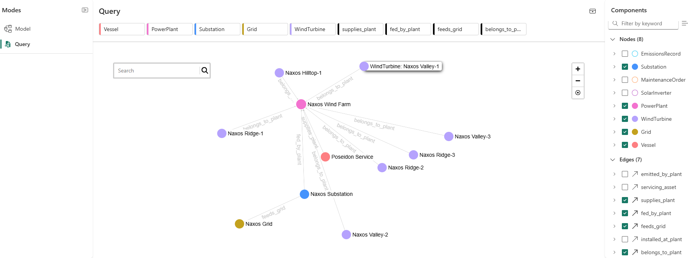
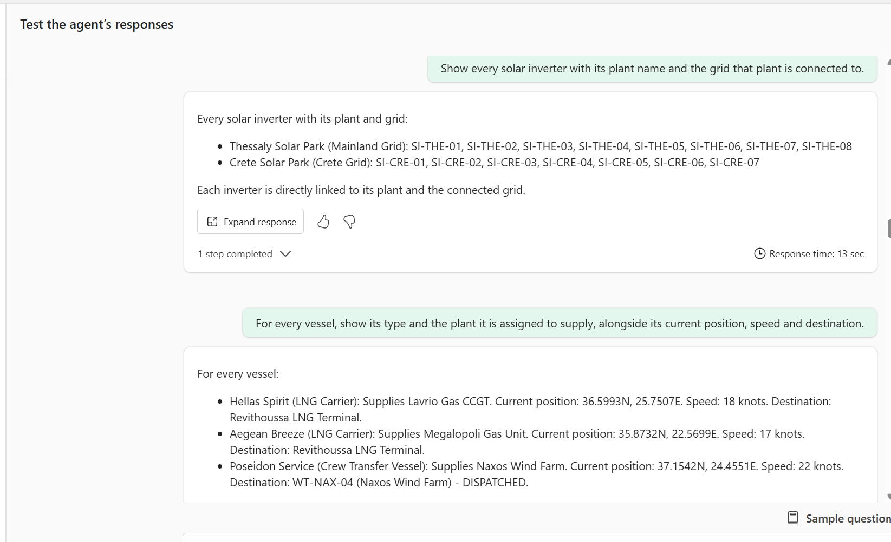

# Fabric Energy RTI + Ontology Demo

End-to-end Microsoft Fabric demo for the energy sector: **Real-Time Intelligence** + **Ontology-driven Data Agents**.

A fictional Greek energy company — **Aegean Power S.A.** — operates wind farms, solar parks, gas plants, an island grid, and a logistics fleet. This demo shows how Microsoft Fabric ties operational telemetry, business data, and AI agents into a single closed-loop story.

> **First time? Set up the environment first.** Follow [SETUP.md](SETUP.md) end-to-end (fork → workspace → sync → setup notebook → simulator → dashboard → enable Python plugin → Data Agent). Once that's green, the script below is the walkthrough you'll narrate live.
>
> Working prompts for the Data Agent live in [docs/PROMPTS.md](docs/PROMPTS.md).

---

## What's in the demo

```
                         ┌──────────────────────┐
                         │  AegeanPower_Simulator│  (notebook → Event Hub)
                         └──────────┬───────────┘
                                    │
                                    ▼
                      ┌─────────────────────────┐
                      │  AegeanPowerStream     │  Eventstream (5 filters)
                      └─────────────┬───────────┘
                                    │
              ┌────────┬────────┬───┴────┬────────┬─────────┐
              ▼        ▼        ▼        ▼        ▼         │
            Wind    Solar    Grid    Vessel   Emissions     │
              │        │        │        │        │         │
              ▼        ▼        ▼        ▼        ▼         │
           ┌────────────────────────────────────────┐       │
           │           AegeanPowerEH (KQL DB)       │◀──────┘
           └────────────┬───────────────────────────┘
                        │
        ┌───────────────┼────────────────────┐
        ▼               ▼                    ▼
  Real-Time      WT-Failures-Activator   AnomalyDetector
  Dashboard         │                    (ML model)
                    ▼
            Dispatch_Maintenance_Crew (notebook)
                    │
                    ▼
            Vessel routing change in simulator
```

Plus the **Ontology + Data Agent** side:

```
   ┌───────────────────┐      ┌──────────────────────┐
   │  AegeanPowerLH    │◀────│  AegeanPowerOntology │
   │  (Delta tables)   │      └──────────────────────┘
   └────────┬──────────┘                │
            │                           ▼
            │              ┌──────────────────────┐
            └─────────────▶│  AegeanPowerDataAgent │   (NL → answers)
                           └──────────────────────┘
```

---

# Demo Script — AegeanPower Live Operations + Ontology

## Fabric artifacts in this workspace

After running [SETUP.md](SETUP.md) the workspace contains:

| Artifact | Type | What it is |
|---|---|---|
| `AegeanPowerLH` | Lakehouse | 8 Delta tables (power plants, wind turbines, solar inverters, vessels, substations, grids, maintenance orders, emissions) seeded from `data/*.csv`. |
| `AegeanPowerEH` | Eventhouse (KQL DB) | Live telemetry tables: `WindTurbineTelemetry`, `SolarInverterTelemetry`, `GridTelemetry`, `VesselPositions`, `EmissionsStream`. |
| `AegeanPowerStream` | Eventstream | Pulls events from the Event Hub the simulator publishes to, fan-outs into the 5 KQL tables above. |
| `AegeanPower_Live_Operations` | Real-Time Dashboard | Multi-page operational dashboard (Overview / Wind / Solar & Emissions / Grid Stability / Fleet) with live tiles + KQL Native ML anomaly tile. |
| `AegeanPowerMap` | Real-Time Map | Live vessel/asset positions on the Aegean Sea. |
| `WT-Failures-Activator` | Activator (Reflex) | Watches `WindTurbineTelemetry.fault_type` and triggers `Dispatch_Maintenance_Crew` on critical faults. |
| `AnomalyDetector_WindTurbine` | Anomaly Detector | AutoML-tuned, continuously-running detector over `WindTurbineTelemetry.vibration_mm_s`, publishes anomaly events to Real-Time Hub. |
| `AegeanPowerOntology` | Ontology | Semantic layer over Lakehouse + Eventhouse: 8 typed entities, 7 relationships, hybrid bindings (static + Timeseries). |
| `AegeanPowerOntology_graph` | Graph (auto-generated) | Navigable graph view of the ontology — entities, relationships, and instance query mode. Created automatically alongside the ontology. |
| `AegeanPowerDataAgent` | Data Agent | NL-to-answers agent bound to `AegeanPowerOntology`. |
| `01_Post_Sync_Setup` | Notebook | Setup orchestrator (KQL mappings, lakehouse bindings, eventstream connection string, dashboard URI, CSV → Delta, ontology bindings). Run once after Git sync. |
| `Load_CSVs_to_Delta` | Notebook | Standalone helper to (re)materialize the 8 Lakehouse Delta tables from the seed CSVs. |
| `AegeanPower_Simulator` | Notebook | Continuously emits realistic telemetry to the Event Hub (wind, solar, grid, vessels, emissions). Long-running — kick off once. |
| `Demo_Trigger_Console` | Notebook | One-cell trigger to inject a critical `WT-NAX-04` failure for the Activator demo. |
| `Dispatch_Maintenance_Crew` | Notebook | Triggered by Activator. Writes the Poseidon Service dispatch control file the simulator polls. |
| `Test_Demo_Prompts` | Notebook | Programmatically runs every prompt in [docs/PROMPTS.md](docs/PROMPTS.md) against the Data Agent for end-to-end smoke testing. |

---

## Pre-demo checklist (5 min before the call)

1. `AegeanPower_Simulator` notebook is running and emitting (KQL `WindTurbineTelemetry | top 1 by timestamp desc` returns recent data).
2. `WT-Failures-Activator` rule shows **Running**.
3. Three tabs open:
   - `AegeanPower_Live_Operations` (dashboard with map)
   - `AegeanPowerDataAgent` (chat ready)
   - `Demo_Trigger_Console` — the notebook you'll use to simulate a critical fault on a Naxos Wind Farm turbine. It writes a fault marker that the eventstream picks up; **Activator** catches the rule, fires `Dispatch_Maintenance_Crew`, and the Poseidon Service vessel (currently in standby at Piraeus Port) flips to **Dispatched** with **Naxos Wind Farm** as its destination. On the live dashboard map you'll watch the vessel leave Piraeus and start tracking toward Naxos, while a new Critical maintenance order materializes against the affected turbine.

---

## Act 1 — Real-Time Dashboard

Open the dashboard. Talk track:

> "This is Aegean Power S.A. — a fictional Greek utility running 20 wind turbines across Thrace, Tinos, and Naxos, 15 solar inverters in Thessaly and Crete, two gas plants in Athens, and a fleet of three service vessels.
> Every 2 seconds, every asset reports power, wind speed, vibration, emissions, position. Everything you see is live."

Point out: turbine power tiles, vessel map, emissions tile, grid frequency. Walk the **Overview**, **Wind**, **Solar & Emissions**, **Grid Stability** and **Fleet** pages so guests see the breadth of the live picture. **Two tiles you must not skip:**

### 1 · The map — Poseidon Service on standby

On the **Aegean Sea – Live Vessel Positions** map and the **Fleet Status** tile (Fleet page), highlight **Poseidon Service** — the Crew Transfer Vessel parked in **Piraeus Port** waiting for a callout. Specifically point out:

- **Speed: 0 knots** — engines idle, not moving.
- **Lat/Lon: 37.94, 23.62** — unchanged refresh after refresh; the dot stays anchored over Piraeus on the map.
- **Destination: "Piraeus Port (standby)"** — the live label confirms it's waiting on station, not en route.


Meanwhile the other two vessels in the **Fleet Status** tile — **Aegean Breeze** and **Hellas Spirit** (the LNG carriers) — are clearly *moving*: non-zero speeds (17–18 knots), heading values changing, and lat/lon ticking each refresh as you can see their dots track across the Aegean on the live map. Use that contrast: two vessels in motion, one parked and waiting.

This is the asset that will get dispatched in Act 3 when a turbine fault fires.


### 2 · The Wind page — KQL Native ML anomaly detection

Switch to the **Wind** page. Point out the **"KQL Native ML – Statistical Anomaly Detection on WT-NAX-07"** chart. This tile runs Kusto's built-in `series_decompose_anomalies` against the live vibration stream — **no separate ML service, no model deployment, no PromptFlow**. The teal line is raw vibration; the orange line is the dynamically-computed baseline; the red dots are points the algorithm flagged as anomalies in real time. Talk track:

> "Anomaly detection here is a one-liner of KQL — the Eventhouse runs the model natively on the stream. No data movement, no model hosting, no extra service to operate."


---

## Act 2 — Activator: catch a turbine failure and respond autonomously

Set up the story before doing anything:

> "AegeanPower's wind fleet is spread across 14 sites in the Aegean Sea. Nobody is going to sit and stare at 90+ turbines on a screen 24/7 — and even if they did, by the time a human reacts, you've already lost minutes of generation and possibly damaged the asset.
> That's the job of **Fabric Activator**. It's the always-on watchdog over our live telemetry: it continuously monitors every single turbine in the fleet, and the moment one reports a critical fault it **automatically notifies the team responsible for that asset** — in our case, the marine service crew on the vessel **`VE-SVC-01` Poseidon Service**, which is on standby at Piraeus Port specifically to repair offshore wind assets.
> No dashboards to babysit, no pager rotations, no glue code. One rule, **`WT-Failures-Activator`**, watches the wind turbine stream, and when `fault_type` flips to a critical value it triggers the `Dispatch_Maintenance_Crew` notebook which dispatches Poseidon to the failed turbine's coordinates. We're about to fake a failure on one of the Naxos turbines and watch the whole loop close — hands off."

### Step 1 · Inject the fault

Run the **`Demo_Trigger_Console`** notebook to simulate a failure on turbine **WT-NAX-04**. The notebook writes a control marker that the simulator picks up on its next tick, injecting a `DEMO_FORCED_FAILURE` event into the live telemetry stream — no manual KQL, no manual eventstream tweak.

> "Turbine WT-NAX-04 just went offline. The simulator emitted a failure event into Eventstream, Eventstream filtered it into the wind turbine table in our Eventhouse, the dashboard auto-refreshed. **All without me touching anything.**"

Point at the **`WT-NAX-04 Live Status (Power & Vibration)`** tile on the Wind page. Both series have been bouncing in their healthy bands — `Power_MW` riding 2–3.5 MW, `Vibration_mm_s` jittering around 0.5–1.5 — and then, at the moment of the forced failure, **both lines drop vertically and pin to 0**. There is no ramp-down, no warning shoulder: power generation stops and the rotor stops spinning at the same instant, exactly what you'd expect from an emergency cut-out.


Switch back to the **Overview** page and point at the **`Active Faults – All Asset Types`** tile. `WT-NAX-04` is now listed with **Severity = OFFLINE**, `Min_Power_MW = 0`, `Max_Vib = 0` — sitting alongside the pre-existing critical/warning faults the dashboard was already tracking. The fault landed in the aggregation within seconds of the trigger; no manual refresh, no separate alert system.


> "Look at the right edge of the chart — both Power_MW and Vibration_mm_s flatline simultaneously. That's the signature of a hard fault: the turbine isn't degrading, it's *down*. And the dashboard reflected it within seconds of the event hitting Eventhouse."

### Step 2 · Watch Activator react

Switch to `WT-Failures-Activator` → **Live feed** tab. A new event marker appears, then the **Action** column shows a notebook run.


You can also confirm the chain end-to-end from the **Monitor hub** (left rail → **Monitor** → **Activities**): the latest entry is `Dispatch_Maintenance_Crew_<runId>` with **Status = Succeeded**, **Item type = Notebook**.


> "Activator saw the fault the instant it landed in the table. It looked up the rule, identified Poseidon Service as the responsible crew, and fired the dispatch notebook automatically. No human paged anyone."

> **Heads up on timing:** Activator catches the failure within a couple of seconds, but **the trigger-to-notebook-start lag is roughly 3–4 minutes** — that's the Activator → Fabric scheduler hop, not the notebook itself (the notebook only takes seconds to execute once it starts).

### Step 3 · See the real-world action

Once the Monitor tab shows `Dispatch_Maintenance_Crew_<runId>` as **Succeeded**, switch back to the dashboard map. Within a few seconds of that completion, the vessel **`VE-SVC-01` (Poseidon Service)** — the one we showed parked at Piraeus in Act 1 — changes heading, leaves the dot at Piraeus and starts moving toward Naxos. The vessel's destination label flips from *"Piraeus Port (standby)"* to *"Naxos Wind Farm"*.

Confirm visually on the **Aegean Sea – Live Vessel Positions** map: the Poseidon Service marker is **no longer at Piraeus** — it's now southeast of Athens, out in the Saronic Gulf, heading toward Naxos. Click the marker to see the new live coordinates (e.g. `24.21, 37.29`) — clearly off-station and underway.



The **Fleet Status** tile reflects the same change in tabular form — contrast it with the Act 1 standby snapshot:

- **Speed** has jumped from `0` knots to `~22` knots — engines on, vessel in transit.
- **Heading** is now `~330°` (NW→SE turn already executed).
- **Lat/Lon** has moved off `37.94, 23.62` (Piraeus) to roughly `37.20, 24.38` — already well into the Saronic Gulf.
- **Destination** has flipped from *"Piraeus Port (standby)"* to **`WT-NAX-04 (Naxos Wind Farm)`** — the exact failed turbine, end-to-end traceability from fault to dispatched asset.

Aegean Breeze and Hellas Spirit (LNG carriers) are unchanged — same speeds, same destinations. Only the vessel that *should* respond has been re-tasked.



> "Activator monitored the fleet, detected the failure, and notified the right team — all autonomously. **Real-time data → real-world action, with zero human intervention in the loop.**"

---

## Act 3 — Anomaly Detector

Open `WindAnomalyDetector`.

Start by setting the contrast against what they've already seen:

> "The **Anomaly Detector** item in Real-Time Intelligence runs the Eventhouse Python plugin, **evaluates multiple ML algorithms against our actual data**, picks the best-fitting model, and then keeps that model **continuously scoring live telemetry in place** — no data movement, no batch job. Sensitivity is exposed as a first-class setting on the item (change it in the UI, no KQL edits); detected anomalies are persisted; and crucially they're published as events to **Real-Time Hub**." ([docs](https://learn.microsoft.com/en-us/fabric/real-time-intelligence/anomaly-detection))

Then make it proactive:

> "Act 2 was reactive — Activator caught a turbine that had **already failed**. This is the opposite: the model has learned the seasonal, daily, and per-asset rhythm of every wind turbine and continuously asks *'is this one drifting away from its own normal?'* — well before any threshold alarm or operator notices. Below is `WT-THR-03` (and as an alternative, `WT-NAX-07`) — vibration creeping outside its normal band over the last few hours. No engineer wrote a rule, no static threshold was crossed; the model learned what 'normal' looks like for that specific asset and flagged it."

Close the loop back to Act 2:

> "Because these anomalies are real Real-Time Hub events, you wire them into **Activator** exactly the same way we wired `fault_type` — except the trigger now fires on a **predicted** problem instead of a confirmed one. So we could potentially send the service vessel out to proactively inspect that turbine **before** it actually fails — we already have signals telling us it's behaving outside its normal pattern, so why wait for the breakdown? That's the shift: **reactive break-fix → predictive maintenance, same stack, zero new code, just one extra event source**."



---

## Act 4 — Ontology-driven Data Agent

### Step 1 · Explore the ontology (`AegeanPowerOntology`)

Open `AegeanPowerOntology`. Navigate to the **business entities** and the **relationships** that wire them together.



> "This is the **AegeanPower ontology** — a **semantic layer that sits on top of our Lakehouse tables**. The Lakehouse holds the raw facts (rows in `wind_turbines`, `vessels`, `maintenance_orders`, `emissions`…). The ontology holds the *meaning*: it declares that a wind turbine **belongs to** a plant, a vessel **supplies** a plant, a maintenance order **services** a plant, a substation is **fed by** a plant and in turn **feeds** a grid. Same data underneath, but now the relationships are first-class, typed, and named in business terms."

Drill into one of the entities — `Vessel` is a good example — and show the **Properties** pane. Notice the columns are bound to **two different sources**: static reference attributes come from the Lakehouse, while live telemetry attributes (marked `Timeseries`) are bound to the Eventhouse stream. `WindTurbine` follows the same pattern — static metadata from the Lakehouse, live signals from Eventhouse.



> "And here's the key trick on top of all that — one entity, two physical sources. The agent doesn't care that `flag` lives in the Lakehouse and `latitude` lives in the Eventhouse; it just sees a `Vessel` with both reference and live properties. So a single prompt like *'where are my vessels right now and what country flag are they sailing under?'* joins cold reference data with hot streaming data transparently, no SQL or KQL written by hand."

---

### Step 2 · Explore the graph (`AegeanPowerOntology_graph`)

Now switch to the **`AegeanPowerOntology_graph`** in the workspace. Fabric generates it automatically the moment the ontology is created, so the navigable graph view of the entities and edges is available out of the box, no extra authoring needed.



Flip to **Query** mode (left rail). Pick a few entities and relationships from the top bar — for example `Vessel`, `PowerPlant`, `Substation`, `Grid`, `WindTurbine` with `supplies_plant`, `fed_by_plant`, `feeds_grid`, `belongs_to_plant` — and Fabric renders the targeted **subgraph** for that slice of the ontology. Useful for showing only the part of the model relevant to the question at hand, instead of the full eight-entity picture.



Run the query and Fabric resolves the schema-level slice you picked against the actual data — every matching instance appears as a node, with the typed edges between them. In the example below the Naxos slice surfaces: `Naxos Wind Farm` at the centre with its seven turbines (`Naxos Ridge-1/2/3`, `Naxos Valley-1/2/3`, `Naxos Hilltop-1`) hanging off via `belongs_to_plant`, `Naxos Substation` connected via `fed_by_plant` and `feeds_grid` to `Naxos Grid`, and `Poseidon Service` linked via `supplies_plant`. Same ontology, now populated with live business reality.



---

### Step 3 · Ask the Data Agent (`AegeanPowerDataAgent`)

Switch to `AegeanPowerDataAgent` and run prompts in order from [docs/PROMPTS.md](docs/PROMPTS.md):

1. *"Show me all wind turbines"* — agent finds the `wind_turbines` table cleanly.
2. *"Which wind turbines are at plants in the Cyclades islands?"* — region vs prefecture trap, the ontology resolves it.
3. *"Which plants have both open maintenance orders and vessels en route?"* — the triple-FK query that only ontology-aware schemas can answer. Lands on **Naxos Wind Farm**.



Why this works (and why it matters):

- **The agent stops guessing joins.** Without the ontology, the LLM has to infer joins from column-name overlap (`plant_id`, `id`, …) — fragile, slow, often wrong. With the ontology, every relationship is declared, typed (`fromEntityType` / `toEntityType`), and named in business terms.
- **One model, multiple Data Agents.** Any Data Agent that points at this ontology gets the same view of the business. Rename a column or move a join in the Lakehouse → fix it once in the ontology, every agent stays correct.
