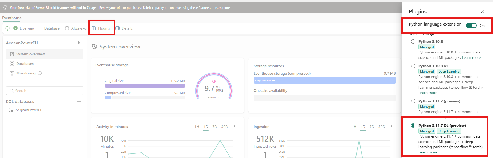

# Setup — Fabric Energy RTI + Ontology Demo

One-time environment setup. Once these steps are done, follow the demo flow in [README.md](README.md).

## 0 · Prerequisites

**Personal:**
- Fabric capacity (F2+ or P SKU). Trial may not support Git integration in all regions.
- **Contributor** or higher on the workspace you create.
- A GitHub account.

**Tenant admin settings** — make sure your Fabric admin has enabled the tenant settings required for:

- **Git integration** — to sync the workspace with this GitHub repo
- **Fabric Data Agent** — see [Configure Fabric data agent tenant settings](https://learn.microsoft.com/en-us/fabric/data-science/data-agent-tenant-settings)
- **Ontology + Graph** — see [Required tenant settings for ontology](https://learn.microsoft.com/en-us/fabric/iq/ontology/overview-tenant-settings)
- **Anomaly Detector (preview)** — see [Anomaly detection in Real-Time Intelligence](https://learn.microsoft.com/en-us/fabric/real-time-intelligence/anomaly-detection?tabs=eventhouse).

Settings can take up to one hour to take effect after the admin toggles them.

---

## 1 · Fork this repo

Click **Fork** (top-right on GitHub) → owner = your account → **Create fork**.

You now own `https://github.com/<you>/fabric-energy-rti-ontology` with the `main` branch.

## 2 · Create an empty Fabric workspace

Fabric portal → **Workspaces** → **+ New** → assign your capacity. Name it whatever you like (e.g. `Energy-Demo-<you>`).

## 3 · Connect your workspace to your fork

In the workspace: **Workspace settings → Git integration → Connect**:

- Provider: **GitHub**
- Authorize (PAT with `Contents: read/write` on your fork)
- Repository URL: `https://github.com/<you>/fabric-energy-rti-ontology`
- Branch: **`main`**
- Git folder: *(blank)*
- **Connect and sync** → **Update all**

Fabric pulls every item into your workspace.

## 4 · Run the one-shot setup notebook

Open **`01_Post_Sync_Setup`** → **Run all**.

This single notebook does **everything that doesn't survive Git sync**:

| # | What it does |
|---|---|
| 1 | Discovers workspace + items by name |
| 2 | Creates KQL ingestion mappings + streaming policy on all 5 telemetry tables |
| 3 | Binds `AegeanPowerLH` as default lakehouse on the 4 working notebooks |
| 4 | Pulls the Eventstream connection string and patches `AegeanPower_Simulator` |
| 5 | Rebinds the Real-Time Dashboard cluster URI |
| 6 | Downloads the 8 seed CSVs from GitHub into `AegeanPowerLH/Files/data/` |
| 7 | Writes the CSVs to 8 Delta tables under `Tables/` |
| 8 | Rebinds Ontology data bindings (KQL + Lakehouse) |

Idempotent — safe to re-run. Takes ~3–5 minutes.

> After the notebook finishes, open **`AegeanPowerStream`** → **Edit** → **Publish** (1 click in the toolbar). Fabric currently has no public REST endpoint to publish an eventstream, so this is the only manual eventstream step.
>
> While you're in the eventstream editor, check that every node (source, transforms, destinations) shows a green/active state. If any node is greyed out or marked inactive, click **Activate all** in the toolbar — telemetry won't flow until every destination is active.

## 5 · Run the simulator

Open **`AegeanPower_Simulator`** → **Run all**. The connection string was already injected in step 4. After ~30 s verify in a KQL query window:

```kql
WindTurbineTelemetry | where timestamp > ago(2m) | summarize n=count(), nonzero=countif(power_mw > 0)
```

Expect `n > 0` and `nonzero > 0`.

## 6 · Open the Real-Time Dashboard

Open **`AegeanPower_Live_Operations`**. Tiles populate within ~30 s. The cluster URI was rebound in step 4 — no manual rebind needed.

## 7 · Enable the Eventhouse Python plugin *(prerequisite for the Anomaly Detector)*

The **`WindAnomalyDetector`** item (shown in Act 3 of the demo) needs the Eventhouse Python runtime to score data. Open **`AegeanPowerEH`** Eventhouse → top toolbar → **Plugins** → toggle **Python language extension** ON → pick **Python 3.11.7 DL** → **Done**.



## 8 · Add a data source to the Data Agent

Open **`AegeanPowerDataAgent`** → **+ Data source** → **Ontology** → pick `AegeanPowerOntology` → **Publish**.

## 9 · You're ready

Walk through the demo flow in [README.md](README.md). Try a prompt from [docs/PROMPTS.md](docs/PROMPTS.md).
