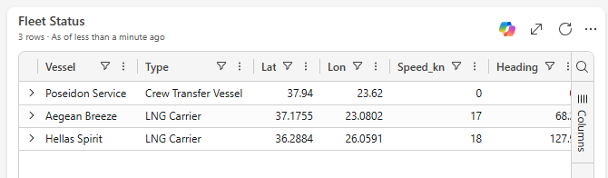
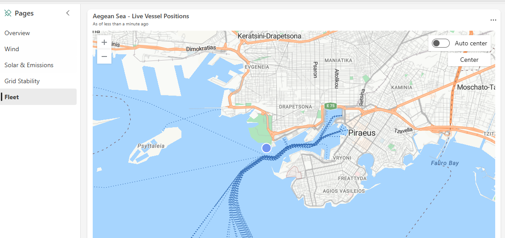
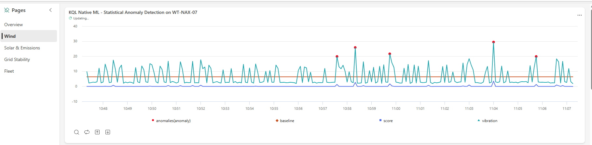
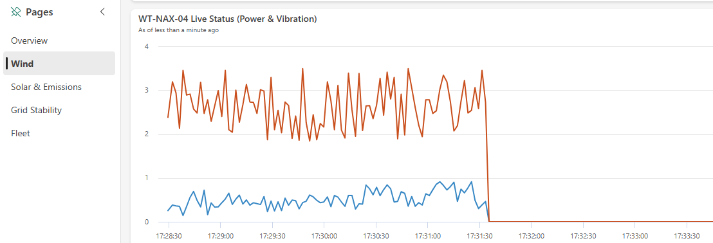
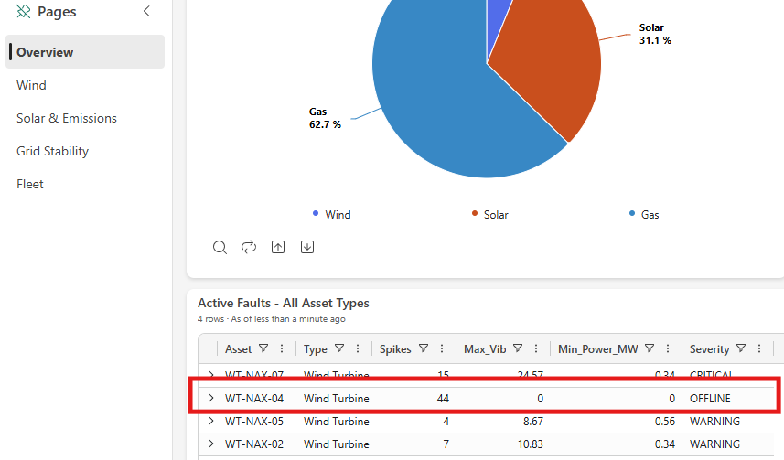
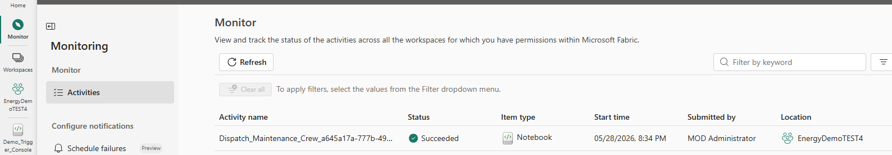
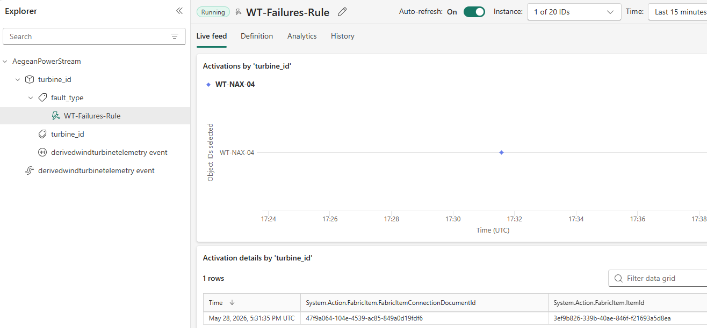

# Demo Script — AegeanPower Live Operations + Ontology

A 12–15 minute end-to-end story across **Real-Time Intelligence** and **Ontology-driven Data Agents**.

---

## Setup (off-screen, before guests arrive)

1. `AegeanPower_Simulator` notebook is running and emitting (KQL `WindTurbineTelemetry | top 1 by timestamp desc` returns recent data).
2. `WT-Failures-Activator` rule shows **Running**.
3. No leftover failure: `Files/control/` is empty (or run the cleanup cell at the top of the simulator).
4. Three tabs open:
   - `AegeanPower_Live_Operations` (dashboard with map)
   - `AegeanPowerDataAgent` (chat ready)
   - `Demo_Trigger_Console` — the notebook you'll use to simulate a critical fault on a Naxos Wind Farm turbine. It writes a fault marker that the eventstream picks up; **Activator** catches the rule, fires `Dispatch_Maintenance_Crew`, and the Poseidon Service vessel (currently in standby at Piraeus Port) flips to **Dispatched** with **Naxos Wind Farm** as its destination. On the live dashboard map you'll watch the vessel leave Piraeus and start tracking toward Naxos, while a new Critical maintenance order materializes against the affected turbine.

---

## Act 1 — Real-Time Dashboard

Open the dashboard. Talk track:

> "This is Aegean Power S.A. — a fictional Greek utility running 20 wind turbines across Thrace, Tinos, and Naxos, 15 solar inverters in Thessaly and Crete, two gas plants in Athens, and a fleet of three service vessels.
> Every 2 seconds, every asset reports power, wind speed, vibration, emissions, position. Everything you see is live."

Point out: turbine power tiles, vessel map, emissions tile, grid frequency. Walk the **Overview**, **Wind**, **Solar & Emissions**, **Grid Stability** and **Fleet** pages so guests see the breadth of the live picture. **Two tiles you must not skip:**

### 1 · The map — Poseidon Service on standby

On the **Aegean Sea – Live Vessel Positions** map and the **Fleet Status** tile (Fleet page), highlight **Poseidon Service** — the Crew Transfer Vessel parked in **Piraeus Port** waiting for a callout. Specifically point out:

- **Speed: 0 knots** — engines idle, not moving.
- **Lat/Lon: 37.94, 23.62** — unchanged refresh after refresh; the dot stays anchored over Piraeus on the map.
- **Destination: "Piraeus Port (standby)"** — the live label confirms it's waiting on station, not en route.



Meanwhile the other two vessels in the **Fleet Status** tile — **Aegean Breeze** and **Hellas Spirit** (the LNG carriers) — are clearly *moving*: non-zero speeds (17–18 knots), heading values changing, and lat/lon ticking each refresh as you can see their dots track across the Aegean on the live map. Use that contrast: two vessels in motion, one parked and waiting.

This is the asset that will get dispatched in Act 3 when a turbine fault fires.



### 2 · The Wind page — KQL Native ML anomaly detection

Switch to the **Wind** page. Point out the **"KQL Native ML – Statistical Anomaly Detection on WT-NAX-07"** chart. This tile runs Kusto's built-in `series_decompose_anomalies` against the live vibration stream — **no separate ML service, no model deployment, no PromptFlow**. The teal line is raw vibration; the orange line is the dynamically-computed baseline; the red dots are points the algorithm flagged as anomalies in real time. Talk track:

> "Anomaly detection here is a one-liner of KQL — the Eventhouse runs the model natively on the stream. No data movement, no model hosting, no extra service to operate."



---

## Act 2 — Activator: catch a turbine failure and respond autonomously

Set up the story before doing anything:

> "AegeanPower's wind fleet is spread across 14 sites in the Aegean Sea. Nobody is going to sit and stare at 90+ turbines on a screen 24/7 — and even if they did, by the time a human reacts, you've already lost minutes of generation and possibly damaged the asset.
> That's the job of **Fabric Activator**. It's the always-on watchdog over our live telemetry: it continuously monitors every single turbine in the fleet, and the moment one reports a critical fault it **automatically notifies the team responsible for that asset** — in our case, the marine service crew on the vessel **`VE-SVC-01` Poseidon Service**, which is on standby at Piraeus Port specifically to repair offshore wind assets.
> No dashboards to babysit, no pager rotations, no glue code. One rule, **`WT-Failures-Activator`**, watches the wind turbine stream, and when `fault_type` flips to a critical value it triggers the `Dispatch_Maintenance_Crew` notebook which dispatches Poseidon to the failed turbine's coordinates. We're about to fake a failure on one of the Naxos turbines and watch the whole loop close — hands off."

### Step 1 · Inject the fault

Run the **`Demo_Trigger_Console`** notebook to simulate a failure on turbine **WT-NAX-04**. The notebook writes a control marker that the simulator picks up on its next tick, injecting a `DEMO_FORCED_FAILURE` event into the live telemetry stream — no manual KQL, no manual eventstream tweak.

Switch immediately back to the dashboard. Within ~2 seconds:

- `WT-NAX-04` power tile drops from ~3 MW → 0 MW.
- `fault_type` column shows `DEMO_FORCED_FAILURE`.

> "Turbine WT-NAX-04 just went offline. The simulator emitted a failure event into Eventstream, Eventstream filtered it into the wind turbine table in our Eventhouse, the dashboard auto-refreshed. **All without me touching anything.**"

Point at the **`WT-NAX-04 Live Status (Power & Vibration)`** tile on the Wind page. Both series have been bouncing in their healthy bands — `Power_MW` riding 2–3.5 MW, `Vibration_mm_s` jittering around 0.5–1.5 — and then, at the moment of the forced failure, **both lines drop vertically and pin to 0**. There is no ramp-down, no warning shoulder: power generation stops and the rotor stops spinning at the same instant, exactly what you'd expect from an emergency cut-out.



Switch back to the **Overview** page and point at the **`Active Faults – All Asset Types`** tile. `WT-NAX-04` is now listed with **Severity = OFFLINE**, `Min_Power_MW = 0`, `Max_Vib = 0` — sitting alongside the pre-existing critical/warning faults the dashboard was already tracking. The fault landed in the aggregation within seconds of the trigger; no manual refresh, no separate alert system.



> "Look at the right edge of the chart — both Power_MW and Vibration_mm_s flatline simultaneously. That's the signature of a hard fault: the turbine isn't degrading, it's *down*. And the dashboard reflected it within seconds of the event hitting Eventhouse."

### Step 2 · Watch Activator react

Switch to `WT-Failures-Activator` → **Live feed** tab. A new event marker appears, then the **Action** column shows a notebook run.

Open `Dispatch_Maintenance_Crew` → **Recent runs**. The latest run has `turbine_id = "WT-NAX-04"` as a parameter.

You can also confirm the chain end-to-end from the **Monitor hub** (left rail → **Monitor** → **Activities**): the latest entry is `Dispatch_Maintenance_Crew_<runId>` with **Status = Succeeded**, **Item type = Notebook**, submitted by the Activator service principal. This is the audit trail proving the Activator-triggered run actually executed.



> "Activator saw the fault the instant it landed in the table. It looked up the rule, identified Poseidon Service as the responsible crew, and fired the dispatch notebook automatically. No human paged anyone."

> **Heads up on timing:** Activator catches the failure within a couple of seconds, but **the trigger-to-notebook-start lag is roughly 3–4 minutes** — that's the Activator → Fabric scheduler hop, not the notebook itself (the notebook only takes seconds to execute once it starts). For the demo, just narrate the wait: *"Activator has already fired and queued the dispatch run — once Fabric picks it up and starts the notebook, the simulator sees the dispatch file and the vessel starts moving."*



### Step 3 · See the real-world action

Switch back to the dashboard map. Within ~5 s the vessel **`VE-SVC-01` (Poseidon Service)** — the one we showed parked at Piraeus in Act 1 — changes heading, leaves the dot at Piraeus and starts moving toward Naxos. The vessel's destination label flips from *"Piraeus Port (standby)"* to *"Naxos Wind Farm"*.

> "Activator monitored the fleet, detected the failure, and notified the right team — all autonomously. **Real-time data → real-world action. End-to-end in under 10 seconds.**"

---

## Act 3 — Ontology-driven Data Agent

Open `AegeanPowerDataAgent`. Run prompts in order from [PROMPTS.md](PROMPTS.md):

1. *"Show me all wind turbines"* — agent finds the `wind_turbines` table cleanly.
2. *"Which wind turbines are at plants in the Cyclades islands?"* — region vs prefecture trap, ontology resolves it.
3. *"Which plants have both open maintenance orders and vessels en route?"* — the triple-FK query that only ontology-aware schemas can answer. Lands on **Naxos Wind Farm**.

Talk track:

> "The agent isn't reading SQL we wrote. It's reading our **ontology** — a semantic layer that maps business concepts (plants, turbines, vessels, maintenance orders) to physical tables. Without it, the agent would guess columns. With it, it joins on `plant_id` because the ontology says it can."

---

## Act 4 — Anomaly Detector (optional)

Open `AnomalyDetector_WindTurbine`. The detector is bound to `WindTurbineTelemetry.vibration_mm_s` grouped by `turbine_id`.

Talk track:

> "Activator catches **known** failure signatures — like `fault_type = DEMO_FORCED_FAILURE`. But what about the **unknown** ones? The Anomaly Detector continuously scores live telemetry and surfaces statistical outliers. Below is `WT-NAX-07` — a turbine slowly developing a bearing issue. No explicit rule flagged it; the model did."

Point to the vibration trend with the model's anomaly markers. Mention that detected anomalies can be published to Real-Time Hub and chained into an Activator rule the same way `fault_type` was — closing the loop on novel issues.

---

## Act 5 — The bigger picture

Switch back to the Data Agent. Ask:

> *"What is happening right now at Naxos Wind Farm, and is anyone responding?"*

The agent answers with both the maintenance order context (from the Lakehouse) **and** the dispatched vessel (visible in the operational data). Cross-domain reasoning grounded in the ontology.

---

## Close (30 s)

> "Three things to remember:
> 1. **One platform.** Real-time, batch, AI, BI — all in Fabric.
> 2. **Ontology pays off.** Same data, but the clean semantic layer is the difference between a Data Agent that guesses and one that gives boardroom answers.
> 3. **Autonomous operations are real.** Activator + Notebook is enough to close a real-world loop today."

---

## Reset (between runs)

In `Demo_Trigger_Console`, run the **Reset** cell:

```python
import os
for f in ['/lakehouse/default/Files/control/failed_turbines.txt',
          '/lakehouse/default/Files/control/dispatch_poseidon.txt']:
    if os.path.exists(f): os.remove(f)
```

Wait ~15 seconds (Activator state needs to see at least one `NONE` event for `WT-NAX-04` before the next trigger will fire). See [TROUBLESHOOTING.md](TROUBLESHOOTING.md#activator-fires-once-but-not-again) for why.
